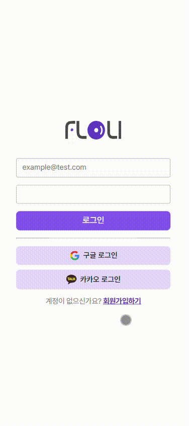
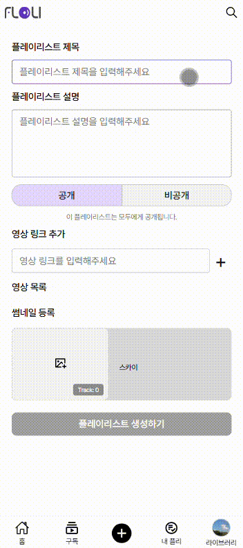
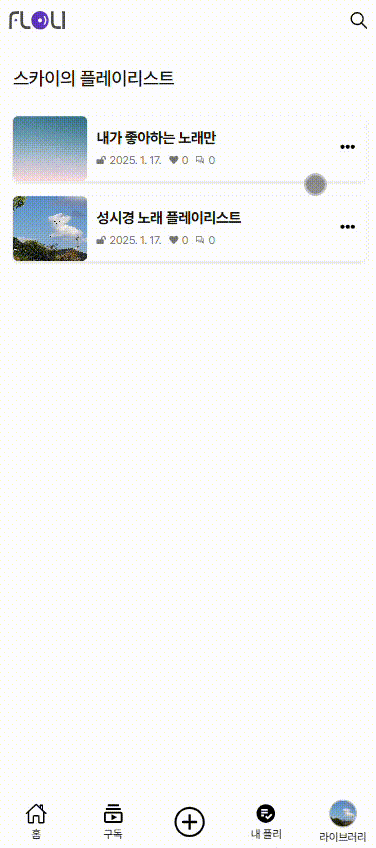
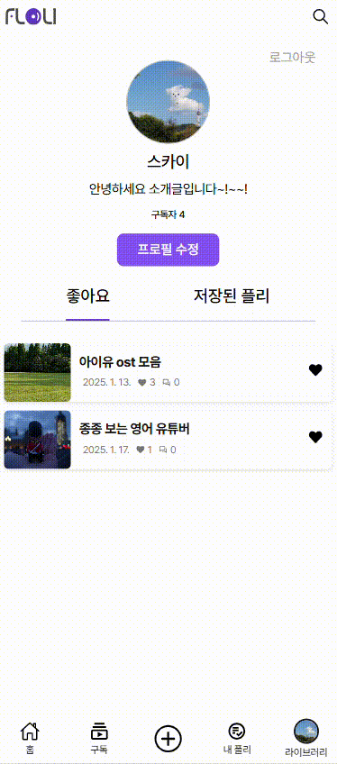
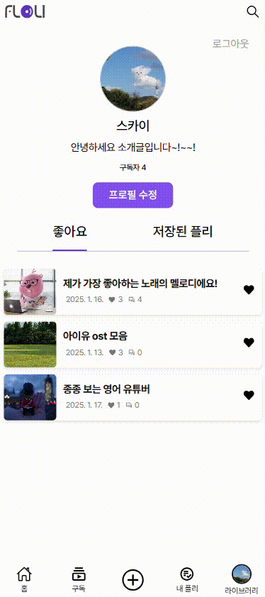
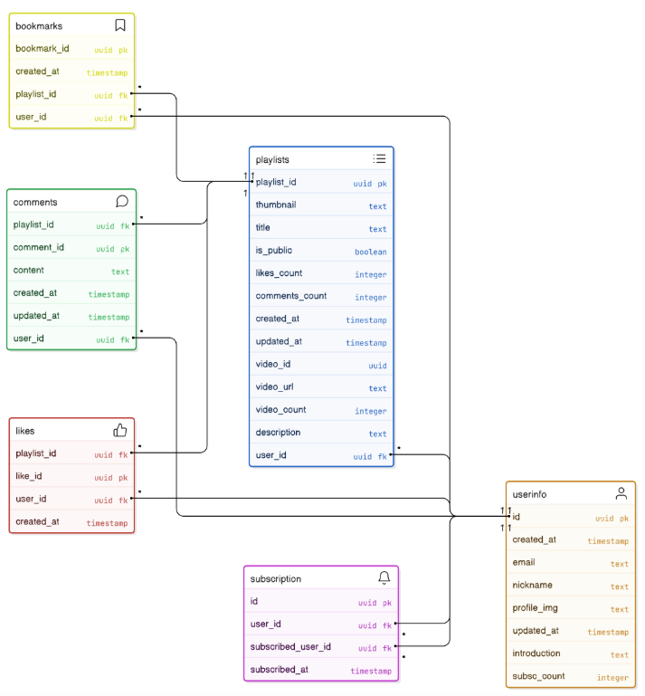

<p align="center" style="display: flex; align-items: center;">
  <h1 align="center">🎵FLOLI - 영상 공유 SNS 플랫폼</h1>
</p>
<p align="center " style="font-size: 16px; line-height: 1.6;">
  <strong>“취향은 나누면 나눌수록 커진다!”</strong><br>
  혼자 보기 아까운 영상, 플레이리스트로 만들어 세상과 공유해보세요!🌟
</p>
<br>

## 팀원 소개

<div align="center">

|  |  |  |  |
| :-------------------------------------------------------------------------------------: | :------------------------------------------------------------------------------------: | :-------------------------------------------------------------------------------------: | :------------------------------------------------------------------------------------: |
|                                       **안혜련**                                        |                                       **권샘이**                                       |                                       **전영훈**                                        |                                       **박진현**                                       |

</div>

<br>

## 프로젝트 소개

**Floli**는 YouTube의 다양한 영상 링크를 모아 **나만의 플레이리스트**를 만들고,  
서로 **공유하고 구독하며** 영상 취향을 중심으로 소통할 수 있는 SNS 플랫폼입니다.

- 🎥 **플레이리스트 만들기**: 내 맘대로 구성한 영상 플레이리스트를 쉽고 간편하게 생성 및 공유
- 🤝 **구독 & 피드**: 서로를 구독하며 '나만의 타임라인' 형성
- 🌍 **취향 중심 네트워킹**: 영상 취향을 기반으로 자유롭게 소통하고 연결

<br>

## 프로젝트 일정


#### 📅 전체 개발 기간 : 2024.12.30 - 2025.01.22 (3주)

- 설계 및 디자인, 프로젝트 세팅 :2024.12.30- 2025.01.06
- UI 및 컴포넌트 구현 : 2025.01.07 -2025.01.09
- 기능 구현 : 2025.01.09 - 2025.01.16
- 리팩토링 : 2025.01.17 - 2025.01.22

<br>

## 기술 스택 및 개발환경

| **기술 스택**                                                                                                                                                                                                     | **도입 이유**                                                                          |
| ----------------------------------------------------------------------------------------------------------------------------------------------------------------------------------------------------------------- | -------------------------------------------------------------------------------------- |
|                                                                                                               | 선언적 UI 작성이 가능하며, 커뮤니티와 생태계가 활발해 빠른 문제 해결이 가능            |
|                                                                                                                 | 빠른 번들링과 개발 서버 실행, 간편한 설정으로 개발 생산성 향상                         |
|                                                                                                     | 정적 타이핑을 통해 버그를 사전에 방지하고, 협업 시 코드 가독성 향상에 유리             |
|                                                                                                  | 비동기 데이터 요청 및 캐싱 기능으로 효율적인 서버 데이터 관리                          |
|                                                                                                                  | 애플리케이션의 전역 상태 관리를 단순하고 직관적으로 관리 및 처리                       |
|                                                                                               | React와 자연스럽게 통합되며, 간결한 API로 폼 상태 관리와 유효성 검사를 효율적으로 처리 |
|                                                                                                                   | 폼 데이터 유효성을 간단하고 직관적으로 처리                                            |
|                                                                                         | CSS-in-JS로 컴포넌트 단위 스타일링이 가능하며, 스타일 충돌을 방지                      |
|                                                                                                         | 실시간 DB, 인증 등 백엔드 기능을 빠르게 구축하고 확장성을 확보                         |
|   | 코드 스타일을 통일하고 품질을 유지하며 잠재적인 오류를 사전에 방지                     |
|                                                                                                               | E2E 테스트를 통해 사용자 경험을 자동화된 방식으로 검증                                 |
|         | 실시간 커뮤니케이션, 작업 관리 및 문서화를 통해 팀 간 효율적인 협업 가능               |

<br>

## ➕ FLOLI 미리보기

| **1. 회원가입 및 소셜 로그인**                                     | **2. 메인 홈 - 모든 플레이리스트 조회, 검색**                | **3. 구독 탭 - 구독한 플레이리스트 필터**                     |
| ------------------------------------------------------------------ | ------------------------------------------------------------ | ------------------------------------------------------------- |
|  |           |            |
| **4. 영상 링크로 플레이리스트 생성**                               | **5. 내 플레이리스트 관리 - 삭제, 공개여부 설정**            | **6. 상세 페이지 - 플레이리스트 세부 정보 확인 및 영상 재생** |
|                 |      |        |
| **7. 마이페이지 - 프로필 수정**                                    | **8. 마이페이지 - 좋아요 및 저장한 플레이리스트 조회**       |                                                               |
|         |  |                                                               |

<!--
회원가입 및 소셜 로그인
사용자는 이메일 및 소셜 계정을 통해 간편하게 회원가입 및 로그인할 수 있습니다.

메인 홈 - 모든 플레이리스트 조회, 검색
모든 사용자가 업로드한 공개 플레이리스트를 확인할 수 있고 검색할 수 있습니다.

구독 탭 - 구독한 사람의 플레이리스트 필터
내가 구독한 사용자들의 플레이리스트만 필터링하여 볼 수 있습니다.

생성 탭 - 영상 링크로 플레이리스트 생성
유튜브 등 영상 링크를 기반으로 새로운 플레이리스트를 쉽게 생성할 수 있습니다.

사용자 프로필 조회
다른 사용자의 프로필과 그들의 공개 플레이리스트를 확인할 수 있습니다.

내 플리 탭 - 내 플레이리스트 관리
내가 만든 플레이리스트 목록을 조회, 삭제하거나 공개 여부를 설정할 수 있습니다.

마이페이지 - 프로필 정보 수정
프로필 사진, 닉네임 등 사용자 정보를 수정할 수 있습니다.

마이페이지 - 좋아요 및 저장한 플레이리스트 조회
좋아요를 누르거나 저장한 플레이리스트를 조회,삭제 할 수 있습니다. -->

## 역할 분담

#### 🧑‍💻안혜련 [@anhyeryeon2](https://github.com/anhyeryeon2)

- PlayList, ConfirmModal 공통 컴포넌트 제작
- 카카오/구글 소셜로그인, 단계별 회원가입 구현
- 영상링크 기반 플레이리스트 생성페이지 UI, 이미지 업로드 기능구현
- 사용자의 플레이리스트 조회, 삭제, 공개여부 설정
- ErrorBoundary 에러 핸들링
- 로그인 , 회원가입 테스트

#### 🧑‍💻권샘이 [@KwonSeami](https://github.com/KwonSeami)

- 기본적인 수준의 디자인 가이드
- Input, 바텀시트 모달, 풀페이지 모달 등 공통 컴포넌트 제작
- 플레이리스트 상세페이지 UI 작업 및 기능 구현
  - 기능에 필요한 데이터 테이블을 생성한 후, 호출&가공하여 적용

    ＋ 관련 custom hooks 제작

  - 구독, 좋아요, 저장을 토글 형태로, 실시간으로 반영되도록 구현
  - 댓글 목록, 댓글 작성/수정/삭제 구현
- 전반적인 테스트

#### 🧑‍💻전영훈 [@Hoonshi](https://github.com/Hoonshi)

- Button, MainHeader,Navbar 공통 컴포넌트 제작
- 마이페이지 UI 및 페이지 내부 플레이리스트 조회, 삭제
- 프로필 수정을 통한 로그인한 유저 정보 수정
- 유저 프로필 UI, 기능 구현

#### 🧑‍💻박진현 [@rondido](https://github.com/rondido)

- Toast, Loadingspinner, Skeleton UI 공통 컴포넌트 제작
- 메인 플레이리스트 조회(구독,플레이리스트 저장, 클립보드 api 공유)
- 구독 목록 페이지 구현(drag slider 구현, 구독 삭제, 구독자의 플레이리스트 조회)
- 검색 페이지 구현(최근 검색어 구현, 검색어 맞는 플레이리스트 조회)
- Suspense를 활용한 Loadingspinner적용
- 무한 스크롤 custom hook 생성

## Git Workflow

<details>
<summary><strong>Branch</strong></summary>

- **`feature` / `develop` / `main`** 브랜치 운용
  - 기능 단위로 PR 작성
- **Feature 브랜치 이름 형식**
  - `이슈라벨/기능명-이슈번호`
    - 예: `feat/add-calendar-23`

</details>

<details>
<summary><strong>Commit</strong></summary>

- **Commit Message 형식**
  - `이슈라벨: 설명#이슈번호`
    - 예: `feat: add-calendar#23`
- **Commit Message 타입**
  - `feat` : 새로운 기능 추가
  - `fix` : 버그 수정
  - `design` : 사용자 UI 디자인 변경 (CSS)
  - `docs` : 문서 수정
  - `test` : 테스트 코드 추가
  - `refact` : 코드 리팩토링
  - `style` : 코드 포맷팅, 세미콜론 누락 등 코드 의미에 영향을 주지 않는 변경사항
  - `chore` : 빌드 부분 혹은 패키지 매니저 수정사항
  - `comment` : 주석 추가 및 변경
  - `rename` : 파일, 폴더 이름 변경
  - `remove` : 파일, 폴더 삭제

</details>

<details>
<summary><strong>Issue & PR</strong></summary>

- **Issue 생성 형식**
  - `<타입>:<내용>` 형식으로 발행
  - 라벨 및 담당자 지정 필수
- **Issue Labels**

  - `bug` : 버그입니다.
  - `chore` : 세팅 관련
  - `cleanup` : 코드 정리 및 제거
  - `docs` : 문서 변경
  - `feature` : 기능 추가 및 구현
  - `fix` : 버그 수정
  - `question` : 질문만 있는 이슈
  - `refactoring` : 리팩토링 차원에서 코드 수정

- **PR 작성 규칙**
  - 2명 이상 승인 필요
  - Slack에 PR 링크 공유
  - 제목 형식: `<타입>:<내용>` (이슈 제목과 통일)

</details>

## 폴더 구조

```
src/
├── apis/                    # API 관련 폴더
│   ├── bookmark/
│   ├── comment/
│   ├── feed/
│   ├── like/
│   └── ...
│
├── assets/                  # 정적 리소스 폴더
│   └── img/
│
├── component/               # 컴포넌트
│   ├── Button/
│   ├── Modal/
│   ├── PlayList/
│   └── ...
│
├── hooks/                   # 커스텀 훅
│   ├── useModal.tsx
│   ├── useToast.ts
│   └── ...
│
├── pages/                   # 페이지 컴포넌트들
│   ├── mypage/
│   ├── search/
│   └── ...
│
├── providers/               # Context Providers
├── repository/              # 데이터 저장소
├── routes/                  # 라우팅 설정
├── schema/                  # 데이터 검증 스키마
├── store/                   # 전역 상태 관리
│   ├── signupStore.ts
│   ├── useAuthStore.ts
│   └── ...
├── styles/                  # 글로벌/공통 스타일
├── supabase/                # Supabase 설정
├── types/                   # TypeScript 타입 정의
├── utils/                   # 유틸리티 함수
│
├── App.tsx
└── main.tsx
```

## 데이터베이스 구조

 

## 설치 및 실행

```
git clone https://github.com/Dev-FE-2/toy-project3-team1.git my-project

cd my-project

npm install
```

```
npm run dev
```

위 명령어를 실행한 후,

브라우저에서 `http://localhost:5137`에 접속하여 애플리케이션을 확인하세요.
